# UAS

## Capaian Perkuliahan

Klik simbol ▶ (panah) untuk membuka konten.

### CLO-0211

Demo: Git Installation

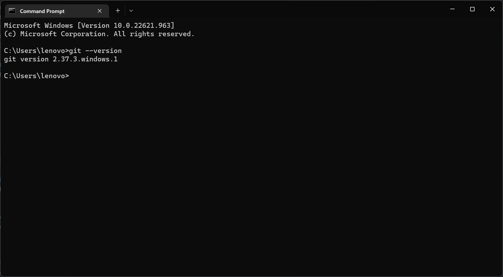

Demo : Hoppscotch / Postman access

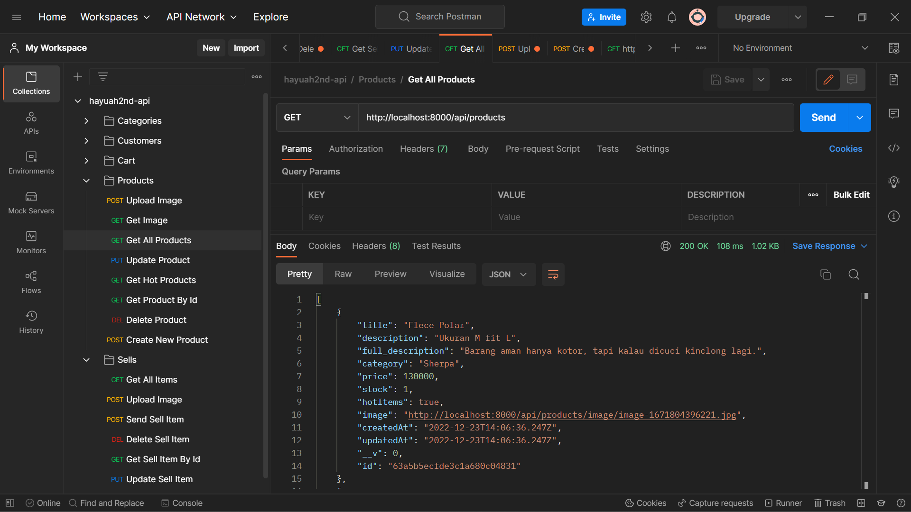

Demo : PHP & Composer installation & hello world

<i>Saya menggunakan NuxtJS sebagai penggantinya.</i>

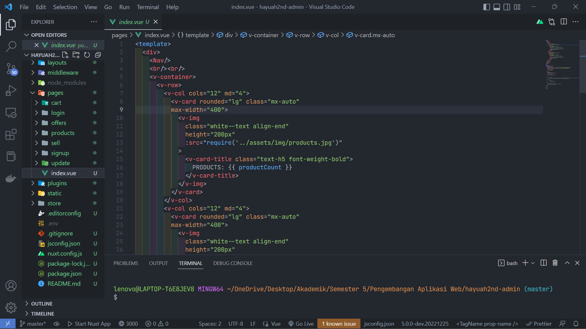

Demo : PostgreSQL / MySQL installation

<i>Saya menggunakan MongoDB sebagai penggantinya.</i>

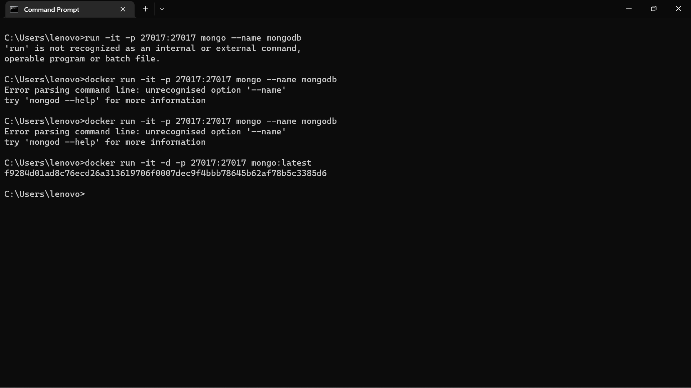

Demo : DBeaver installation & DB connection

<i>Saya menggunakan MongoDB Compass sebagai penggantinya.</i>

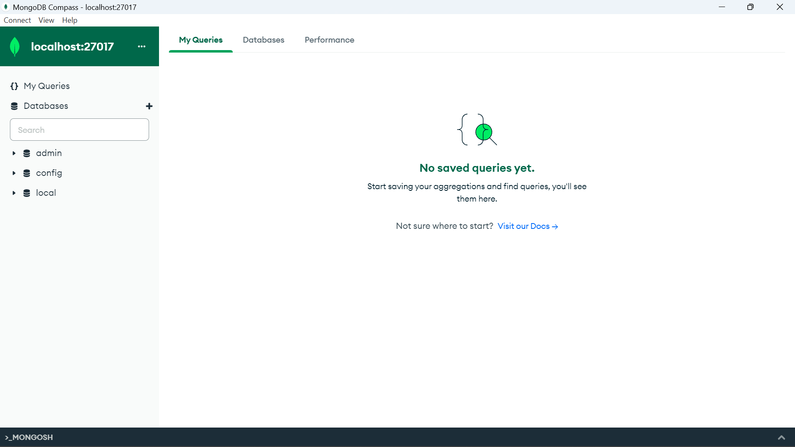

Demo : MobaXterm installation & SSH connection

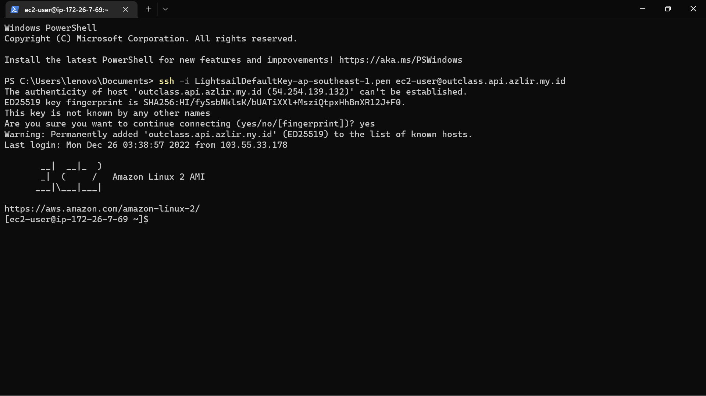

Demo : NodeJS & NPM installation, operation & hello world

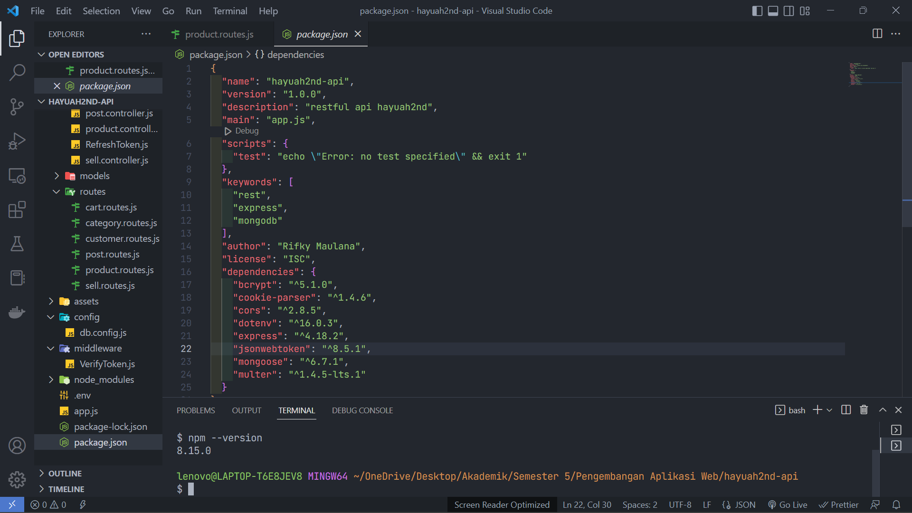

Demo : Linux server operation

Demo : Nginx / Apache web server installation & operation

Demo : Cpanel operation

Demo : Domain registration

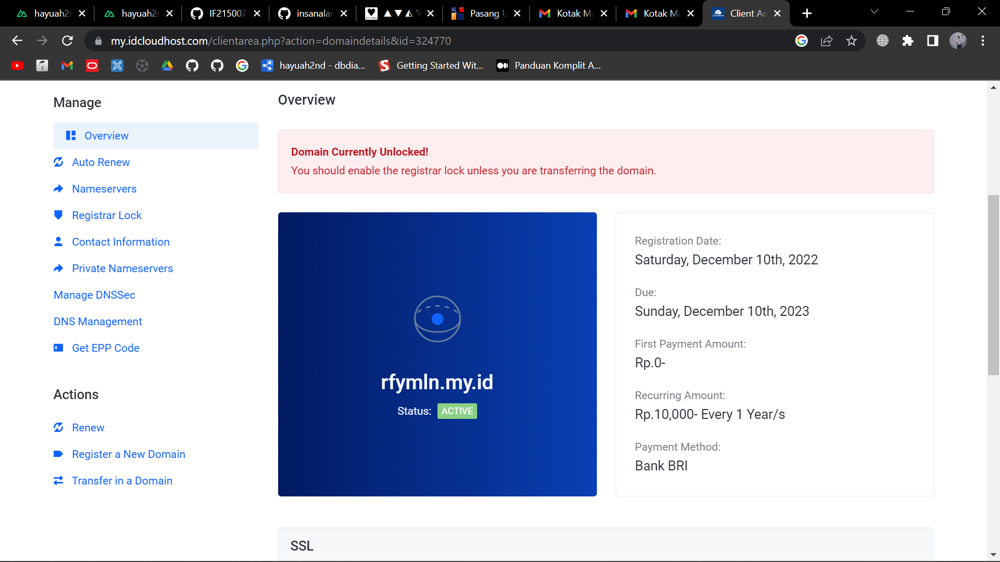

### CLO-0212

Demo : HTML Responsive Layout with Media Query & Flexbox

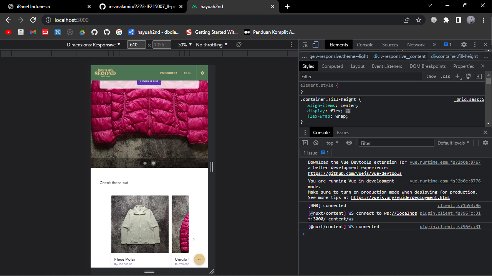

Demo : Javascript Data Transformation

Demo : Browser API - Event Handling, Local Storage, Element manipulation

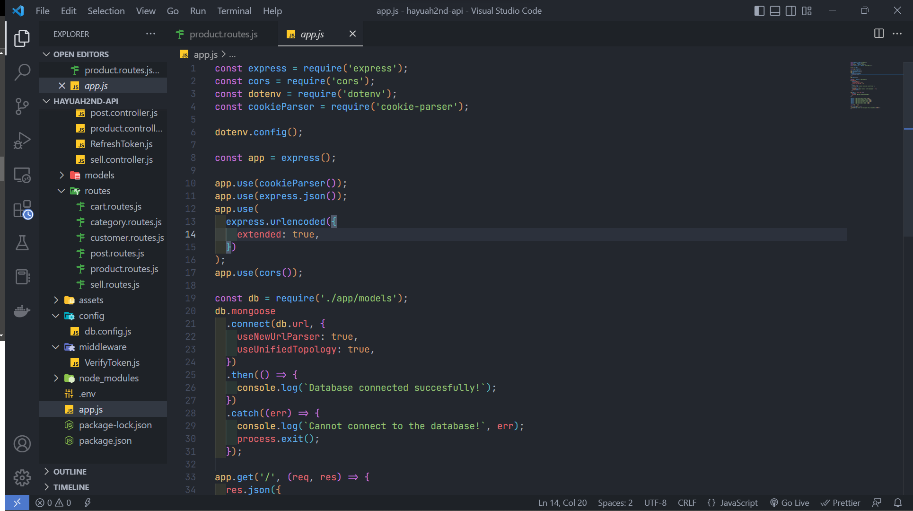

Demo : HTTP GET & POST using Form Action and Fetch API

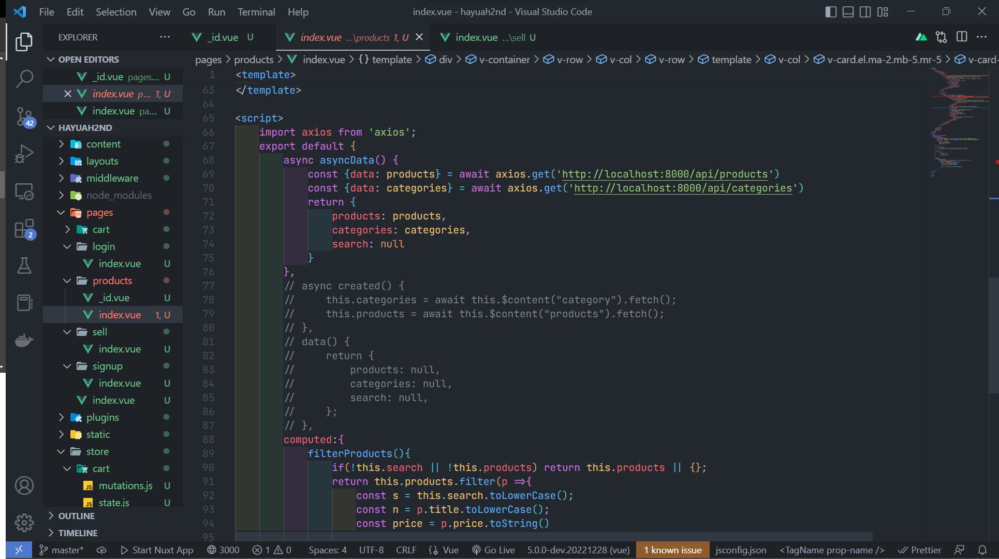

Demo : PHP DB - Dynamic Web Page

Demo : PHP DB - Web Service

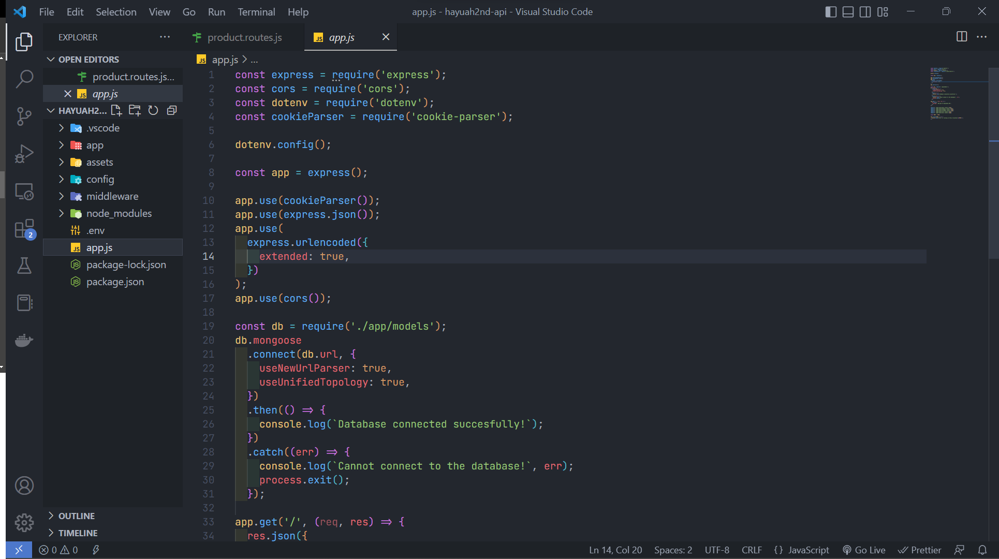

Demo : OOP-based PHP Project using Composer

Demo : Deploy PHP Project to Cpanel

### CLO-0213

Demo : HTML Responsive Layout with Bootstrap

Demo : Single Page App with React & React-router

Demo : Dynamic Web Page using Laravel

Demo : Web Service using Slim

Demo : News Site using Wordpress

